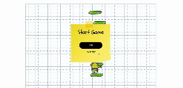
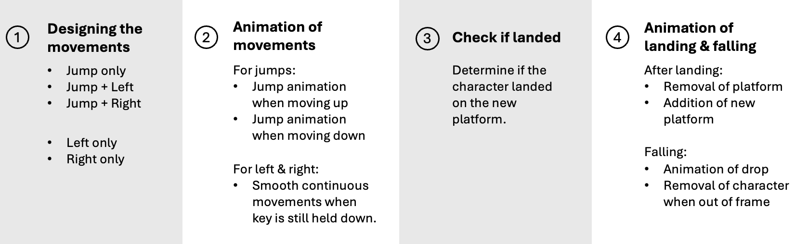

# Doodle Jump Using Vanilla JS

## About The Game

Inspired by the classic Doodle Jump, this platformer game challenges players to leap from platform to platform in an endless ascent, all while avoiding a fall. However, unlike the original, my version gives players full control over each jump and restricts players from falling back onto previous platforms, introducing a new level of skill and challenge.


<a href="https://xxiuminn.github.io/doodle-jump-game/">Click here to try out my version of the game!</a>

## Technologies Used

- HTML
- CSS
- Vanilla Javascript

## Game Design



To design the game, I need to achieve these 4 main goals:

1. Triggering player movements
2. Animating movements
3. Determining if the player has landed
4. Animating landing and falling

## Detecting Player Movement

Considering the various keyboard controls, here are the actions that a player could possibly take:

- <b>Move left:</b> Press the left arrow key only.
- <b>Move right:</b> Press the right arrow key only.
- <b>Jump:</b> Press the spacebar only.
- <b>Jump left:</b>
  - Press spacebar and left arrow key simultaneously.
  - Press spacebar first, then press left arrow key while still holding the spacebar.
  - Press left arrow key first, then press spacebar while still holding the left arrow key.
- <b>Jump right:</b>
  - Press spacebar and right arrow key simultaneously.
  - Press spacebar first, then press right arrow key while still holding the spacebar.
  - Press right arrow key first, then press spacebar while still holding the right arrow key.

### Methods Used:

The initial idea might be to use addEventListener for keydown events. However, a limitation of solely using addEventListener is its inability to handle two keydown events simultaneously. This means that if a player tries to jump left or jump right, only the first keydown event will be registered. This is problematic because executing only one of the keys will result in the player missing the landing, as precise movements are necessary.

To address this, I need to have an addEventListener for keyup events as well, and introduce new variables to track which keys are pressed simultaneously.

## Animating Movements

### For Pure Left & Right Movements:

When holding down the left or right key, one would naturally expect the character to move continuously, as is common in most games.However, another limitation of using addEventListener is that one press equates to one trigger, so the player can only move the set distance for that single press. Holding the key longer would not result in additional movement.

To achieve smooth left and right movements and allow the character to continue moving when the key is held down, I use a setInterval to repeatedly check if the key remains pressed and clearInterval when the key is released.

```
    startLeft = setInterval(() =>
    {
      charLeft -= 2;
      character.style.left = String(charLeft) + "px";
});
```

```
document.addEventListener("keyup", (event) =>
{ switch (event.key) {
  case "ArrowLeft":
      keys.left = false;
      clearInterval(startLeft);
      break;
      }
});
```

### For Jumps:

The actual height of the jump holds little significance; what truly counts is where the player lands after executing the jump. Consequently, I opted for CSS keyframes to animate the upward motion, as I do not need to precisely track the player's position while ascending. I positioned the apex of the jump at the midpoint of the frame's height, albeit this detail is relatively inconsequential.

A challenge with CSS keyframes is that once the animation reaches 100%, the player reverts to its original position or platform, which is not our desired outcome; instead, the player should land on the next platform.

```
.isJumping {
  animation: jump 400ms;
}

@keyframes jump {
  50% {
    top: 50%;
  }
}
```

## Landing Animation

To manage the downward movement of the jump, I intervened the CSS animation and implemented another setInterval to override the descent animation. This allowed me to preset the player's final position after each jump.

```
const drop = setInterval((gravity) => {
      if (
        charTop < (screenHeight / (numOfPlat + 1)) * 7 - 92 &&
        parseInt(platformArr[5].style.top) !==
          screenHeight - screenHeight / (numOfPlat + 1)
      ) {
        charTop += 1;
        character.style.top = String(charTop) + "px";
        for (let i = 0; i < numOfPlat; i++) {
          let platTop = parseInt(platformArr[i].style.top);
          platTop += 1;
          platformArr[i].style.top = String(platTop) + "px";
        }
      }})
```

After the player successfully jumps onto the next platform, we need to shift the platforms downward. This will remove the previous platform the player was on and make room for new platforms to appear from the top.

```
//add platforms
function addPlat() {
  const platform = document.createElement("div");
  document.querySelector(".platformcontainer").prepend(platform);
  platform.classList.add("platform");
  platform.style.top = String(screenHeight / (numOfPlat + 1)) + "px";
  platform.style.left = String(Math.random() * (screenWidth - 120)) + "px";
  platformArr.splice(0, 0, platform);
}
```

```
//remove platforms
function removePlat() {
  platformArr.pop();
  let platform = document.querySelector(".platformcontainer");
  platform.removeChild(platform.lastElementChild);
}
```

## Determining If Player Landed

A reliable method to determine if a player has landed is by checking their position. Once the player jumps and reaches the preset height, we will check their x-axis position (determined by the left position) and compare it to the new platform's position where the player is supposed to land. If the player's position falls within the platform's width, they have successfully landed; if not, they have failed.

```
if (
    parseInt(character.style.top) ===
    screenHeight - screenHeight / (numOfPlat + 1) - 92
  ) {
    if (
      parseInt(character.style.left) >
        parseInt(platformArr[6].style.left) - 92 &&
      parseInt(character.style.left) < parseInt(platformArr[6].style.left) + 120
    ) {
      //if character survives
      haveLanded = true;
    }
  }
```

## Falling Animation

Similarly to the downward movement of the jump, the falling animation follows the same concept. This time, once the player falls below the screen, they will be removed and no longer visible.

```
const die = setInterval(() => {
        charTop += 1;
        character.style.top = String(charTop) + "px";
        if (charTop > screenHeight) {
          //remove character from screen
          character.style.display = "none";
          //remove the fall animation
          clearInterval(die);
        }
      }, 1);
```

## Future Developments

- Introduce multiple levels featuring moving platforms.
- Incorporate broken platforms and various elements on the platforms that will deduct points and reduce lives if the player collides with them.

## Credits

- Soundtracks from uppbeat:
  - https://uppbeat.io/t/color-parade/pixel-playground
  - Mouth pop - single loud
  - Whoosh & ding
- Assets
  - Doodle's left, right profile and platform images from https://github.com/ImKennyYip/doodle-jump/blob/master/doodler-left.png
  - Background image for starting, game and gameover screen from freepik.com
